## Android期中实验
本实验是基于NotePad应用实现基本功能以及功能扩展。
此实验使用的JDK版本为corretto-11.0.25，gradle版本为6.7.1。

其中完成了两项基本功能和两项功能扩展，如下：
1.NoteList界面中笔记条目增加时间戳显示
2.添加笔记查询功能（根据标题或内容查询）
3.笔记颜色更换
4.笔记排序

### 项目主要结构
#### 主要的类
MyCursorAdapter类 继承SimpleCursorAdapter
NoteColor类 选择颜色
NoteEditor类 编辑笔记内容
NotePad 存储数据结构定义
NotePadProvider类 笔记本的ContentProvider，包含数据库相关操作
NotesList类 应用程序入口，首页面会显示笔记列表
NoteSearch类 实现笔记查询
NoteLiveFolder 用于创建实时文件夹，便于访问和查看笔记
TitleEditor类 修改笔记标题

#### 主要的布局文件
note_color.xml 颜色界面布局
note_editor.xml 笔记主页布局
note_search.xml 笔记查询布局
noteslist_item.xml 笔记列表布局
title_editor.xml 修改笔记标题布局

#### 主要的菜单文件
editor_options_menu.xml 编辑操作的菜单布局
list_context_menu.xml 笔记编辑的上下文菜单布局
list_options_menu.xml 笔记主页操作的菜单布局

### 准备工作
先找到文件夹values里的string.xml，在里面添加后面所需要的值。
```properties
<?xml version="1.0" encoding="utf-8"?>

<resources>
    <string name="app_name">NotePad</string>
    <string name="live_folder_name">Notes</string>

    <string name="title_edit_title">Note title:</string>
    <string name="title_create">New note</string>
    <string name="title_edit">Edit: %1$s</string>
    <string name="title_notes_list">Notes</string>
    <string name="search_note">Note Search</string>

    <string name="menu_add">New note</string>
    <string name="menu_save">Save</string>
    <string name="menu_delete">Delete</string>
    <string name="menu_open">Open</string>
    <string name="menu_revert">Revert changes</string>
    <string name="menu_copy">Copy</string>
    <string name="menu_paste">Paste</string>
    <string name="menu_search">Search</string>
    <string name="menu_color">Color</string>
    <string name="menu_sort">Sort</string>
    <string name="menu_sort1">创建时间排序</string>
    <string name="menu_sort2">修改时间排序</string>
    <string name="menu_sort3">颜色排序</string>

    <string name="button_ok">OK</string>
    <string name="text_title">Title:</string>

    <string name="resolve_edit">Edit note</string>
    <string name="resolve_title">Edit title</string>

    <string name="error_title">Error</string>
    <string name="error_message">Error loading note</string>
    <string name="nothing_to_save">There is nothing to save</string>
</resources>
```
## 基本功能
### 1. `NoteList界面中笔记条目增加时间戳显示`
#### 1.1
修改NotesList.java中PROJECTION的内容，添加NotePad.Notes.COLUMN_NAME_MODIFICATION_DATE字段，使其能读取修改后的时间字段。
```properties
private static final String[] PROJECTION = new String[] {
            NotePad.Notes._ID,
            NotePad.Notes.COLUMN_NAME_TITLE,
            NotePad.Notes.COLUMN_NAME_MODIFICATION_DATE
    };
```
#### 1.2
修改NotesList.java中适配器的内容，将NotePad.Notes.COLUMN_NAME_MODIFICATION_DATE装配到dataColumns中，同时viewIDs中也要增加一个文本框R.id.text2来存放时间字段。
```properties
        final String[] dataColumns = {NotePad.Notes.COLUMN_NAME_TITLE, NotePad.Notes.COLUMN_NAME_MODIFICATION_DATE};
        int[] viewIDs = {android.R.id.text1, R.id.text2};
```
#### 1.3
修改layout文件夹中noteslist_item.xml的内容，添加一个TextView组件，同时，还要注意他们的位置顺序与界面布局。
```properties
<?xml version="1.0" encoding="utf-8"?>
<LinearLayout xmlns:android="http://schemas.android.com/apk/res/android"
    android:layout_width="match_parent"
    android:layout_height="match_parent"
    android:orientation="vertical"
    android:paddingLeft="6dp"
    android:paddingRight="6dp"
    android:paddingBottom="3dp">

    <TextView
        android:id="@android:id/text1"
        android:layout_width="match_parent"
        android:layout_height="?android:attr/listPreferredItemHeight"
        android:gravity="center_vertical"
        android:maxLines="1"
        android:paddingLeft="5dp"
        android:textAppearance="?android:attr/textAppearanceLarge" />

    <TextView
        android:id="@+id/text2"
        android:layout_width="match_parent"
        android:layout_height="wrap_content"
        android:gravity="center_vertical"
        android:maxLines="1"
        android:textAppearance="?android:attr/textAppearanceLarge" />
</LinearLayout>
```
#### 1.4
修改NoteEditor.java中updateNote方法中的时间类型，记得用setTimeZone把时区转为东八区的时间。
```properties
private void updateNote(String text, String title) {
        ContentValues values = new ContentValues();
        Long now = Long.valueOf(System.currentTimeMillis());
        SimpleDateFormat sf = new SimpleDateFormat("yyyy-MM-dd HH:mm:ss");
        sf.setTimeZone(TimeZone.getTimeZone("GMT+8:00"));
        Date d = new Date(now);
        String format = sf.format(d);
        values.put(NotePad.Notes.COLUMN_NAME_MODIFICATION_DATE, format);
        if (mState == STATE_INSERT) {
            if (title == null) {
                int length = text.length();
                title = text.substring(0, Math.min(30, length));
                if (length > 30) {
                    int lastSpace = title.lastIndexOf(' ');
                    if (lastSpace > 0) {
                        title = title.substring(0, lastSpace);
                    }
                }
            }
            values.put(NotePad.Notes.COLUMN_NAME_TITLE, title);
        } else if (title != null) {
            values.put(NotePad.Notes.COLUMN_NAME_TITLE, title);
        }
        values.put(NotePad.Notes.COLUMN_NAME_NOTE, text);
        getContentResolver().update(mUri, values, null, null);
    }
```
#### `完成效果如下`

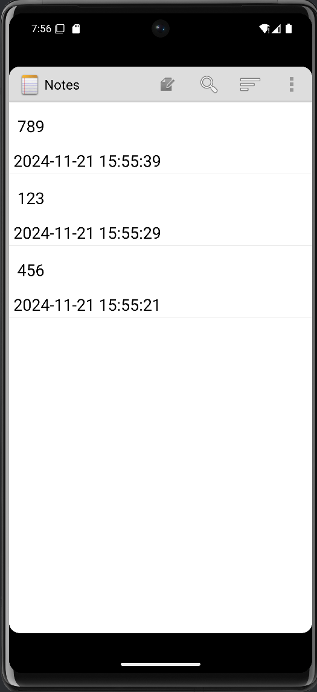

### 2. `添加笔记查询功能（根据标题或内容查询）`
#### 2.1
修改menu文件夹中list_options_menu.xml的内容，在布局文件中添加搜索功能的图标，这个图标是软件自带的，不需要外部导入。
```properties
<?xml version="1.0" encoding="utf-8"?>
<menu xmlns:android="http://schemas.android.com/apk/res/android">
    <item
        android:id="@+id/menu_add"
        android:alphabeticShortcut='a'
        android:icon="@drawable/ic_menu_compose"
        android:showAsAction="always"
        android:title="@string/menu_add" />
    <item
        android:id="@+id/menu_paste"
        android:alphabeticShortcut='p'
        android:icon="@drawable/ic_menu_compose"
        android:title="@string/menu_paste" />
    <item
        android:id="@+id/menu_search"
        android:icon="@android:drawable/ic_menu_search"
        android:showAsAction="always"
        android:title="@string/menu_search" />
</menu>
```
#### 2.2
在layout文件夹中，新建一个查找笔记内容的布局文件note_search.xml，要注意SearchView要在ListView之前，不然搜索的内容会在输入框之上。
```properties
<?xml version="1.0" encoding="utf-8"?>
<LinearLayout xmlns:android="http://schemas.android.com/apk/res/android"
    android:layout_width="match_parent"
    android:layout_height="match_parent"
    android:orientation="vertical">

    <SearchView
        android:id="@+id/search_view"
        android:layout_width="match_parent"
        android:layout_height="wrap_content"
        android:iconifiedByDefault="false" />

    <ListView
        android:id="@+id/list_view"
        android:layout_width="match_parent"
        android:layout_height="wrap_content" />
</LinearLayout>
```
#### 2.3
修改NotesList.java中的onOptionsItemSelected方法，在里面添加相关的查询处理功能，其实就是多了个case选项。
```properties
    @Override
    public boolean onOptionsItemSelected(MenuItem item) {
        switch (item.getItemId()) {
            case R.id.menu_add:
                startActivity(new Intent(Intent.ACTION_INSERT, getIntent().getData()));
                return true;
            case R.id.menu_paste:
                startActivity(new Intent(Intent.ACTION_PASTE, getIntent().getData()));
                return true;
            case R.id.menu_search:
                Intent intent = new Intent(this, NoteSearch.class);
                this.startActivity(intent);
                return true;
            default:
                return super.onOptionsItemSelected(item);
        }
    }
```
#### 2.4
新建一个NoteSearch.java类，用来实现笔记内容的查询功能。
```properties
package com.example.android.notepad;

import android.app.Activity;
import android.content.Intent;
import android.database.Cursor;
import android.database.sqlite.SQLiteDatabase;
import android.os.Bundle;
import android.widget.ListView;
import android.widget.SearchView;
import android.widget.SimpleCursorAdapter;
import android.widget.Toast;

public class NoteSearch extends Activity implements SearchView.OnQueryTextListener {
    ListView listView;
    SQLiteDatabase sqLiteDatabase;
    private static final String[] PROJECTION = new String[]{
            NotePad.Notes._ID,
            NotePad.Notes.COLUMN_NAME_TITLE,
            NotePad.Notes.COLUMN_NAME_MODIFICATION_DATE
    };

    public boolean onQueryTextSubmit(String query) {
        Toast.makeText(this, "you choose:" + query, Toast.LENGTH_SHORT).show();
        return false;
    }

    @Override
    protected void onCreate(Bundle savedInstanceState) {
        super.onCreate(savedInstanceState);
        setContentView(R.layout.note_search);
        SearchView searchView = (SearchView) findViewById(R.id.search_view);
        Intent intent = getIntent();
        if (intent.getData() == null) {
            intent.setData(NotePad.Notes.CONTENT_URI);
        }
        listView = (ListView) findViewById(R.id.list_view);
        sqLiteDatabase = new NotePadProvider.DatabaseHelper(this).getReadableDatabase();
        searchView.setSubmitButtonEnabled(true);
        searchView.setQueryHint("search");
        searchView.setOnQueryTextListener(this);
    }

    public boolean onQueryTextChange(String string) {
        String selection1 = NotePad.Notes.COLUMN_NAME_TITLE + " like ? or " + NotePad.Notes.COLUMN_NAME_NOTE + " like ?";
        String[] selection2 = {"%" + string + "%", "%" + string + "%"};
        Cursor cursor = sqLiteDatabase.query(NotePad.Notes.TABLE_NAME, PROJECTION,
                selection1, selection2, null, null, NotePad.Notes.DEFAULT_SORT_ORDER);
        String[] dataColumns = {NotePad.Notes.COLUMN_NAME_TITLE,
                NotePad.Notes.COLUMN_NAME_MODIFICATION_DATE};
        int[] viewIDs = {android.R.id.text1, android.R.id.text2};
        SimpleCursorAdapter adapter = new SimpleCursorAdapter(
                this, R.layout.noteslist_item, cursor, dataColumns, viewIDs);
        listView.setAdapter(adapter);
        return true;
    }
}
```
#### 2.5
在AndroidManifest.xml里面添加NoteSearch的活动，这样才能实现搜索功能。
```properties
        <activity
            android:name=".NoteSearch"
            android:label="@string/search_note" />
```
#### `完成效果如下`

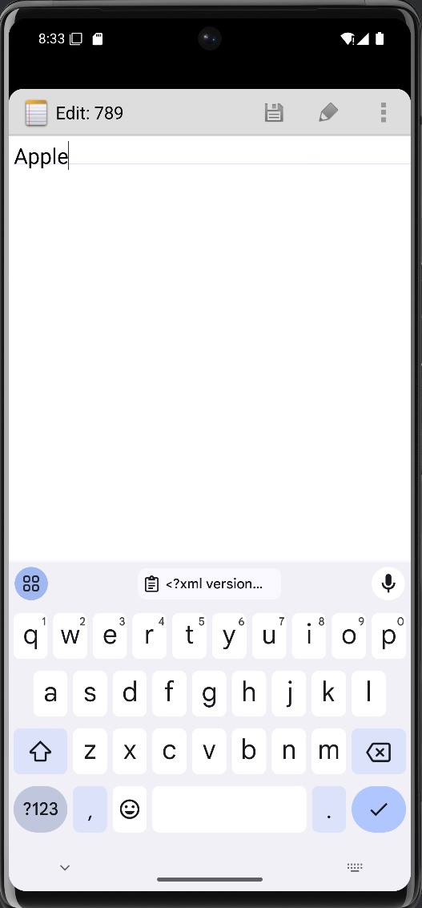

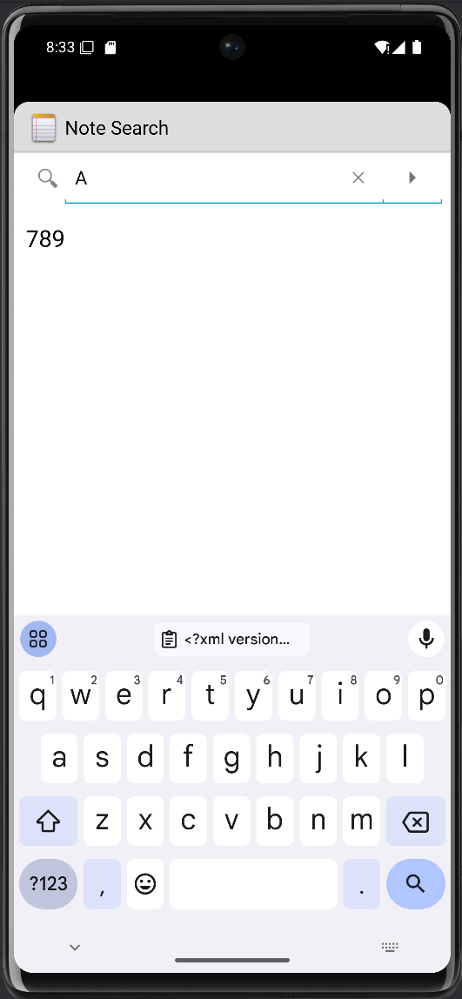

## 功能扩展
### 3.  `笔记颜色更改`
#### 3.1
在NotePad.java中添加新的颜色字段。
```properties
        public static final String COLUMN_NAME_BACK_COLOR = "color";
        public static final int DEFAULT_COLOR = 0;
        public static final int YELLOW_COLOR = 1;
        public static final int BLUE_COLOR = 2;
        public static final int GREEN_COLOR = 3;
        public static final int RED_COLOR = 4;
```
#### 3.2
在NotePadProvider.java中的onCreate方法中，也就是创建数据库表的地方添加颜色的字段。
```properties
       @Override
       public void onCreate(SQLiteDatabase db) {
           db.execSQL("CREATE TABLE " + NotePad.Notes.TABLE_NAME + "   ("
                   + NotePad.Notes._ID + " INTEGER PRIMARY KEY,"
                   + NotePad.Notes.COLUMN_NAME_TITLE + " TEXT,"
                   + NotePad.Notes.COLUMN_NAME_NOTE + " TEXT,"
                   + NotePad.Notes.COLUMN_NAME_CREATE_DATE + " INTEGER,"
                   + NotePad.Notes.COLUMN_NAME_MODIFICATION_DATE + " INTEGER,"
                   + NotePad.Notes.COLUMN_NAME_BACK_COLOR + " INTEGER" //color
                   + ");");
       }
```
#### 3.3
在NotePadProvider.java中添加对其相应的处理方法，
```properties
    static {
        sUriMatcher = new UriMatcher(UriMatcher.NO_MATCH);
        sUriMatcher.addURI(NotePad.AUTHORITY, "notes", NOTES);
        sUriMatcher.addURI(NotePad.AUTHORITY, "notes/#", NOTE_ID);
        sUriMatcher.addURI(NotePad.AUTHORITY, "live_folders/notes", LIVE_FOLDER_NOTES);
        sNotesProjectionMap = new HashMap<String, String>();
        sNotesProjectionMap.put(NotePad.Notes._ID, NotePad.Notes._ID);
        sNotesProjectionMap.put(NotePad.Notes.COLUMN_NAME_TITLE, NotePad.Notes.COLUMN_NAME_TITLE);
        sNotesProjectionMap.put(NotePad.Notes.COLUMN_NAME_NOTE, NotePad.Notes.COLUMN_NAME_NOTE);
        sNotesProjectionMap.put(NotePad.Notes.COLUMN_NAME_CREATE_DATE,
                NotePad.Notes.COLUMN_NAME_CREATE_DATE);
        sNotesProjectionMap.put(
                NotePad.Notes.COLUMN_NAME_MODIFICATION_DATE,
                NotePad.Notes.COLUMN_NAME_MODIFICATION_DATE);
        sNotesProjectionMap.put(
                NotePad.Notes.COLUMN_NAME_BACK_COLOR,
                NotePad.Notes.COLUMN_NAME_BACK_COLOR);
        sLiveFolderProjectionMap = new HashMap<String, String>();
        sLiveFolderProjectionMap.put(LiveFolders._ID, NotePad.Notes._ID + " AS " + LiveFolders._ID);
        sLiveFolderProjectionMap.put(LiveFolders.NAME, NotePad.Notes.COLUMN_NAME_TITLE + " AS " +
            LiveFolders.NAME);
    }
```
以及刚开始启动时的默认属性。
```properties
    @Override
    public Uri insert(Uri uri, ContentValues initialValues) {
        if (sUriMatcher.match(uri) != NOTES) {
            throw new IllegalArgumentException("Unknown URI " + uri);
        }
        ContentValues values;
        if (initialValues != null) {
            values = new ContentValues(initialValues);
        } else {
            values = new ContentValues();
        }
        Long now = Long.valueOf(System.currentTimeMillis());
        if (values.containsKey(NotePad.Notes.COLUMN_NAME_CREATE_DATE) == false) {
            values.put(NotePad.Notes.COLUMN_NAME_CREATE_DATE, now);
        }
        if (values.containsKey(NotePad.Notes.COLUMN_NAME_MODIFICATION_DATE) == false) {
            values.put(NotePad.Notes.COLUMN_NAME_MODIFICATION_DATE, now);
        }
        if (values.containsKey(NotePad.Notes.COLUMN_NAME_TITLE) == false) {
            Resources r = Resources.getSystem();
            values.put(NotePad.Notes.COLUMN_NAME_TITLE, r.getString(android.R.string.untitled));
        }
        if (values.containsKey(NotePad.Notes.COLUMN_NAME_NOTE) == false) {
            values.put(NotePad.Notes.COLUMN_NAME_NOTE, "");
        }
        if (values.containsKey(NotePad.Notes.COLUMN_NAME_BACK_COLOR) == false) {
            values.put(NotePad.Notes.COLUMN_NAME_BACK_COLOR, NotePad.Notes.DEFAULT_COLOR);
        }
        SQLiteDatabase db = mOpenHelper.getWritableDatabase();
        long rowId = db.insert(NotePad.Notes.TABLE_NAME,
                NotePad.Notes.COLUMN_NAME_NOTE, values);
        if (rowId > 0) {
            Uri noteUri = ContentUris.withAppendedId(NotePad.Notes.CONTENT_ID_URI_BASE, rowId);
            getContext().getContentResolver().notifyChange(noteUri, null);
            return noteUri;
        }
        throw new SQLException("Failed to insert row into " + uri);
    }
```
#### 3.4
新建一个MyCursorAdapter.java类，继承SimpleCursorAdapter，将颜色填充到ListView中。
```properties
package com.example.android.notepad;

import android.content.Context;
import android.database.Cursor;
import android.graphics.Color;
import android.view.View;
import android.widget.SimpleCursorAdapter;

public class MyCursorAdapter extends SimpleCursorAdapter {
    public MyCursorAdapter(Context context, int layout, Cursor c,
                           String[] from, int[] to) {
        super(context, layout, c, from, to);
    }
    @Override
    public void bindView(View view, Context context, Cursor cursor) {
        super.bindView(view, context, cursor);
        int columnIndex = cursor.getColumnIndex(NotePad.Notes.COLUMN_NAME_BACK_COLOR);
        if (columnIndex != -1) {
            int x = cursor.getInt(columnIndex);
            switch (x) {
                case NotePad.Notes.DEFAULT_COLOR:
                    view.setBackgroundColor(Color.rgb(255, 255, 255));
                    break;
                case NotePad.Notes.YELLOW_COLOR:
                    view.setBackgroundColor(Color.rgb(247, 216, 133));
                    break;
                case NotePad.Notes.BLUE_COLOR:
                    view.setBackgroundColor(Color.rgb(165, 202, 237));
                    break;
                case NotePad.Notes.GREEN_COLOR:
                    view.setBackgroundColor(Color.rgb(161, 214, 174));
                    break;
                case NotePad.Notes.RED_COLOR:
                    view.setBackgroundColor(Color.rgb(244, 149, 133));
                    break;
                default:
                    view.setBackgroundColor(Color.rgb(255, 255, 255));
                    break;
            }
        }
    }
}
```
#### 3.5
在NotesList.java中的PROJECTION中添加颜色字段。
```properties
    private static final String[] PROJECTION = new String[]{
            NotePad.Notes._ID,
            NotePad.Notes.COLUMN_NAME_TITLE,
            NotePad.Notes.COLUMN_NAME_MODIFICATION_DATE,
            NotePad.Notes.COLUMN_NAME_BACK_COLOR
    };
```
并把NotesList.java类中的SimpleCursorAdapter改为MyCursorAdapter。
```properties
//        SimpleCursorAdapter adapter
//            = new SimpleCursorAdapter(
//                      this,                             // The Context for the ListView
//                      R.layout.noteslist_item,          // Points to the XML for a list item
//                      cursor,                           // The cursor to get items from
//                      dataColumns,
//                      viewIDs
//              );
        MyCursorAdapter adapter = new MyCursorAdapter(
                this,
                R.layout.noteslist_item,
                cursor,
                dataColumns,
                viewIDs
        );
```
#### 3.6
在menu文件夹中的editor_options_menu.xml中添加一个更改背景的功能选项图标，这个项目里是有的。
```properties
    <item android:id="@+id/menu_color"
        android:title="@string/menu_color"
        android:icon="@drawable/ic_menu_edit"
        android:showAsAction="always"/>
```
#### 3.7
在NoteEditor.java中的onOptionsItemSelected方法的switch中添加选择颜色的选项。
```properties
    @Override
    public boolean onOptionsItemSelected(MenuItem item) {
        switch (item.getItemId()) {
            case R.id.menu_save:
                String text = mText.getText().toString();
                updateNote(text, null);
                finish();
                break;
            case R.id.menu_delete:
                deleteNote();
                finish();
                break;
            case R.id.menu_revert:
                cancelNote();
                break;
            case R.id.menu_color:
                changeColor();
                break;
        }
        return super.onOptionsItemSelected(item);
    }
```
并加上对应的颜色选择方法。
```properties
    private void changeColor() {
        Intent intent = new Intent(null, mUri);
        intent.setClass(NoteEditor.this, NoteColor.class);
        NoteEditor.this.startActivity(intent);
    }
```
#### 3.8
在layout文件夹中，新建布局文件note_color.xml，垂直线性布局放置5个ImageButton，对选择颜色的界面进行布局。
```properties
<?xml version="1.0" encoding="utf-8"?>
<LinearLayout xmlns:android="http://schemas.android.com/apk/res/android"
    android:layout_width="match_parent"
    android:layout_height="match_parent"
    android:orientation="horizontal">

    <ImageButton
        android:id="@+id/color_white"
        android:layout_width="0dp"
        android:layout_height="50dp"
        android:layout_weight="1"
        android:background="@color/colorWhite"
        android:onClick="white" />

    <ImageButton
        android:id="@+id/color_yellow"
        android:layout_width="0dp"
        android:layout_height="50dp"
        android:layout_weight="1"
        android:background="@color/colorYellow"
        android:onClick="yellow" />

    <ImageButton
        android:id="@+id/color_blue"
        android:layout_width="0dp"
        android:layout_height="50dp"
        android:layout_weight="1"
        android:background="@color/colorBlue"
        android:onClick="blue" />

    <ImageButton
        android:id="@+id/color_green"
        android:layout_width="0dp"
        android:layout_height="50dp"
        android:layout_weight="1"
        android:background="@color/colorGreen"
        android:onClick="green" />

    <ImageButton
        android:id="@+id/color_red"
        android:layout_width="0dp"
        android:layout_height="50dp"
        android:layout_weight="1"
        android:background="@color/colorRed"
        android:onClick="red" />
</LinearLayout>
```
同时，在values文件夹中，新建资源文件color.xml,添加所需颜色。
```properties
<?xml version="1.0" encoding="utf-8"?>
<resources>

    <color name="colorWhite">#fff</color>
    <color name="colorYellow">#FFD885</color>
    <color name="colorBlue">#A5CAED</color>
    <color name="colorGreen">#A1D6AE</color>
    <color name="colorRed">#F49585</color>

</resources>
```
#### 3.9
创建NoteColor.java类，用来选择笔记颜色。
```properties
package com.example.android.notepad;

import android.app.Activity;
import android.content.ContentValues;
import android.database.Cursor;
import android.net.Uri;
import android.os.Bundle;
import android.view.View;

public class NoteColor extends Activity {
    private Cursor mCursor;
    private Uri mUri;
    private int color;
    private static final int COLUMN_INDEX_TITLE = 1;
    private static final String[] PROJECTION = new String[]{
            NotePad.Notes._ID, // 0
            NotePad.Notes.COLUMN_NAME_BACK_COLOR,
    };

    public void onCreate(Bundle savedInstanceState) {
        super.onCreate(savedInstanceState);
        setContentView(R.layout.note_color);
        mUri = getIntent().getData();
        mCursor = getContentResolver().query(mUri, PROJECTION, null, null, null);
    }

    @Override
    protected void onResume() {
        if (mCursor != null) {
            mCursor.moveToFirst();
            //color = mCursor.getInt(COLUMN_INDEX_TITLE);
            color = mCursor.getInt(1); // 1是COLUMN_NAME_BACK_COLOR的索引
        }
        super.onResume();
    }

    @Override
    protected void onPause() {
        super.onPause();

        if (mCursor != null) {//
            mCursor.close();//
        }//

        ContentValues values = new ContentValues();
        values.put(NotePad.Notes.COLUMN_NAME_BACK_COLOR, color);
        getContentResolver().update(mUri, values, null, null);
    }

    public void white(View view) {
        color = NotePad.Notes.DEFAULT_COLOR;
        finish();
    }

    public void yellow(View view) {
        color = NotePad.Notes.YELLOW_COLOR;
        finish();
    }

    public void blue(View view) {
        color = NotePad.Notes.BLUE_COLOR;
        finish();
    }

    public void green(View view) {
        color = NotePad.Notes.GREEN_COLOR;
        finish();
    }

    public void red(View view) {
        color = NotePad.Notes.RED_COLOR;
        finish();
    }
}
```
并在清单文件AndroidManifest.xml中添加NoteColor活动，以及给页面换个主题，把黑色换成白色，在AndroidManifest.xml中的Activity中添加，白色能更好的体现笔记颜色更换的效果。
```properties
        <activity
            android:name=".NoteColor"
            android:label="ChangeColor"
            android:windowSoftInputMode="stateVisible" />
```
```properties
        <activity
            android:name=".NotesList"
            android:exported="true"
            android:label="@string/title_notes_list"
            android:theme="@android:style/Theme.Holo.Light">
        <activity
            android:name=".NoteEditor"
            android:configChanges="keyboardHidden|orientation"
            android:exported="true"
            android:screenOrientation="sensor"
            android:theme="@android:style/Theme.Holo.Light"
            tools:ignore="DiscouragedApi">
        <activity
            android:name=".TitleEditor"
            android:exported="true"
            android:icon="@drawable/ic_menu_edit"
            android:label="@string/title_edit_title"
            android:theme="@android:style/Theme.Holo.Dialog"
            android:windowSoftInputMode="stateVisible">
        <activity
            android:name=".NoteSearch"
            android:label="@string/search_note"
            android:theme="@android:style/Theme.Holo.Light" />

        <activity
            android:name=".NoteColor"
            android:label="ChangeColor"
            android:theme="@android:style/Theme.Holo.Light.Dialog"
            android:windowSoftInputMode="stateVisible" />
```
#### `完成效果如下`
（由于是完成后才截图，所以这里是和上面截图一样的白色，原来的项目是黑色的）

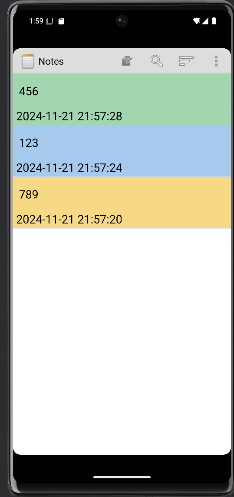

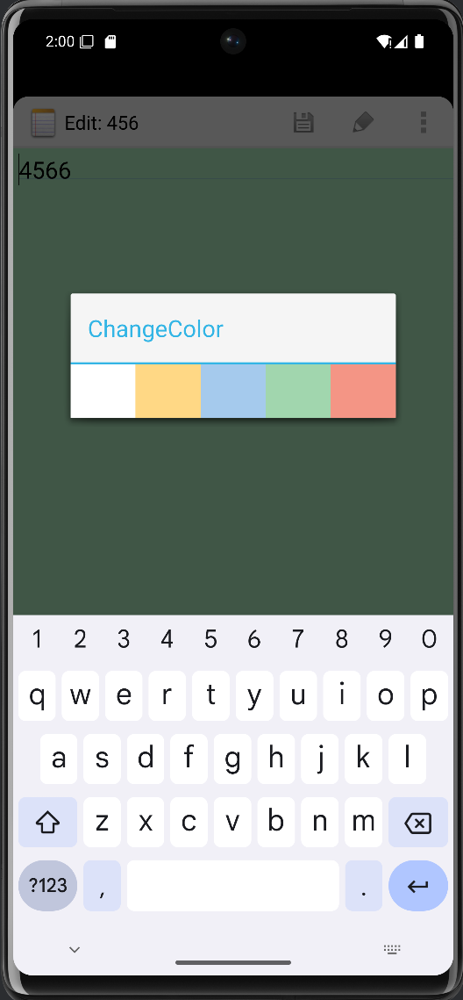

### 4. `笔记排序`
#### 4.1
在menu文件夹的菜单文件list_options_menu.xml中添加新的item。
```properties
    <item
        android:id="@+id/menu_sort"
        android:icon="@android:drawable/ic_menu_sort_by_size"
        android:showAsAction="always"
        android:title="@string/menu_sort">
        <menu>
            <item
                android:id="@+id/menu_sort1"
                android:title="@string/menu_sort1" />
            <item
                android:id="@+id/menu_sort2"
                android:title="@string/menu_sort2" />
            <item
                android:id="@+id/menu_sort3"
                android:title="@string/menu_sort3" />
        </menu>
    </item>
```
#### 4.2
在NoteList.java类中的onOptionsItemSelected方法的switch中添加新的case选项。
```properties
    @Override
    public boolean onOptionsItemSelected(MenuItem item) {
        switch (item.getItemId()) {
            case R.id.menu_add:
                startActivity(new Intent(Intent.ACTION_INSERT, getIntent().getData()));
                return true;
            case R.id.menu_paste:
                startActivity(new Intent(Intent.ACTION_PASTE, getIntent().getData()));
                return true;
            case R.id.menu_search:
                Intent intent = new Intent(this, NoteSearch.class);
                this.startActivity(intent);
                return true;
            case R.id.menu_sort1:
                cursor = managedQuery(
                        getIntent().getData(),
                        PROJECTION,
                        null,
                        null,
                        NotePad.Notes._ID
                );
                adapter = new MyCursorAdapter(
                        this,
                        R.layout.noteslist_item,
                        cursor,
                        dataColumns,
                        viewIDs
                );
                setListAdapter(adapter);
                return true;
            case R.id.menu_sort2:
                cursor = managedQuery(
                        getIntent().getData(),
                        PROJECTION,
                        null,
                        null,
                        NotePad.Notes.DEFAULT_SORT_ORDER
                );
                adapter = new MyCursorAdapter(
                        this,
                        R.layout.noteslist_item,
                        cursor,
                        dataColumns,
                        viewIDs
                );
                setListAdapter(adapter);
                return true;
            case R.id.menu_sort3:
                cursor = managedQuery(
                        getIntent().getData(),
                        PROJECTION,
                        null,
                        null,
                        NotePad.Notes.COLUMN_NAME_BACK_COLOR
                );
                adapter = new MyCursorAdapter(
                        this,
                        R.layout.noteslist_item,
                        cursor,
                        dataColumns,
                        viewIDs
                );
                setListAdapter(adapter);
                return true;
            default:
                return super.onOptionsItemSelected(item);
        }
    }
```
#### 4.3
因为排序会多次用到adapter，cursor等，所以把他们定义在外面。
```properties
    private MyCursorAdapter adapter;
    private Cursor cursor;
    private String[] dataColumns = {NotePad.Notes.COLUMN_NAME_TITLE, NotePad.Notes.COLUMN_NAME_MODIFICATION_DATE};
    private int[] viewIDs = {android.R.id.text1, R.id.text2};
```
#### `完成效果如下`
根据创建时间排序

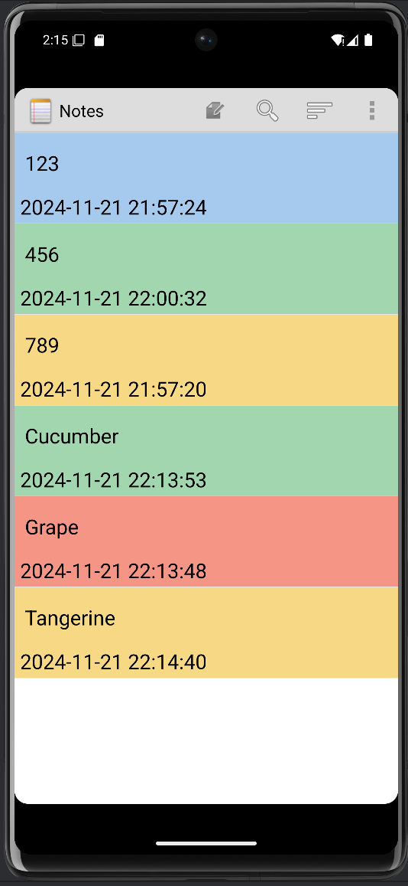

根据修改时间排序

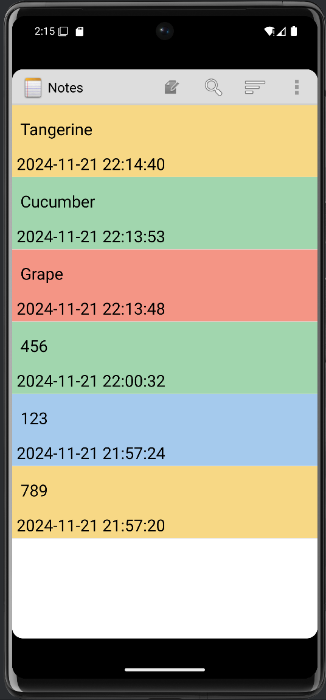

根据颜色排序

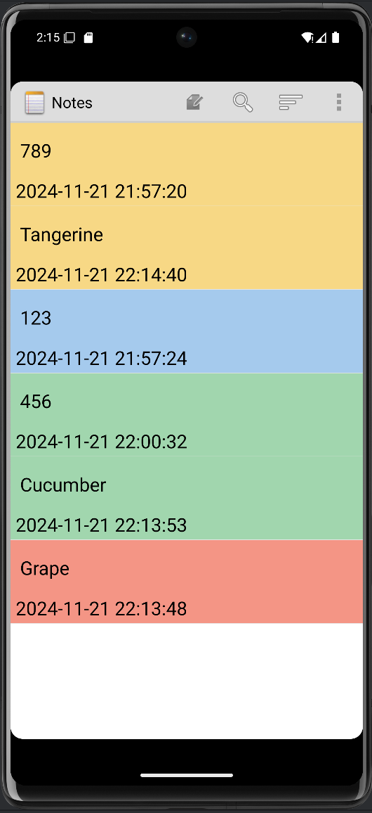

### `补充`
若运行项目时出现花屏等类似现象，可以试试下面方法。

#### 点击模拟器旁的小点点，并点击小铅笔Edit

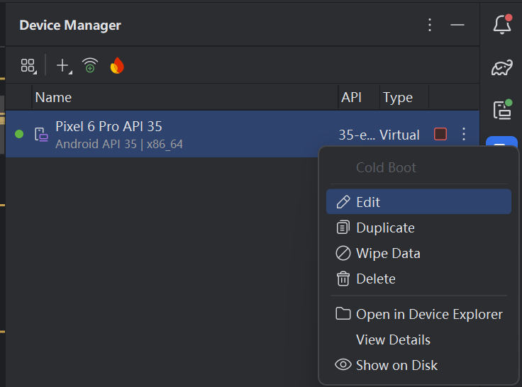

#### 在这个界面左下方找到Graphics

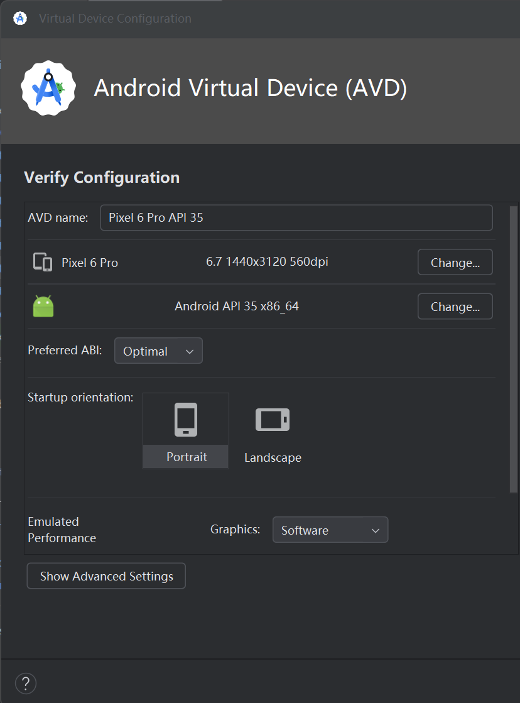

#### 一般这里是Automatic，改成Software就行

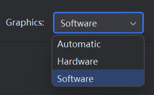

注意！如果改不了很可能是因为模拟器是有这个图标，意思是默认自动渲染。

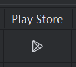

### `以上就是全部内容了，感谢您的浏览！`
